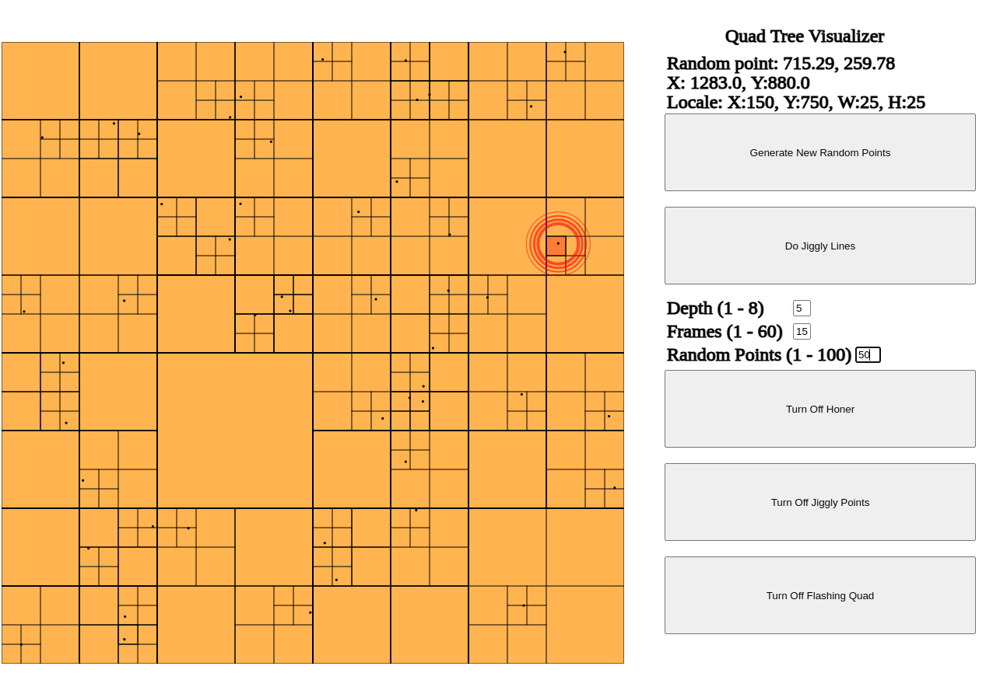

# Quad Tree Visualizer

This is a little tool to help one visualize the steps involved in a recursive quad-tree drill down.

The first randomly generated point - assuming more than one - is followed along the drill down. The other points are represented but not "followed" along stepwise, as the first is in each generation.  

A proper data structure wasn't implemented here, which would be needed for integration into a simulation/game context.

## TODOs
1. Add proper data structure for reuse
